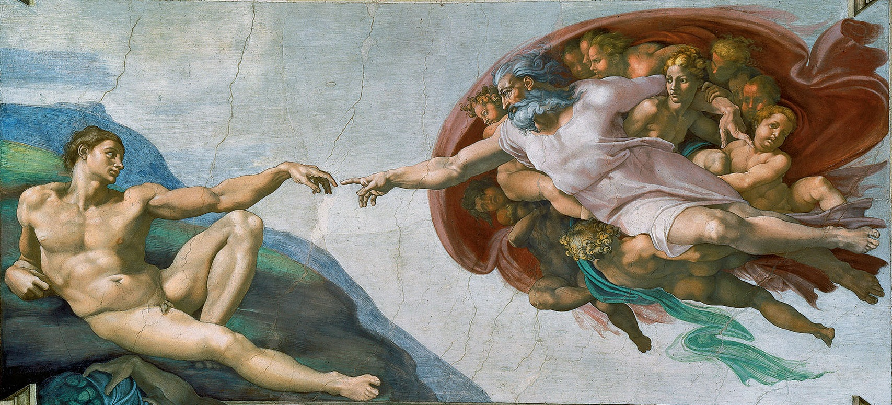
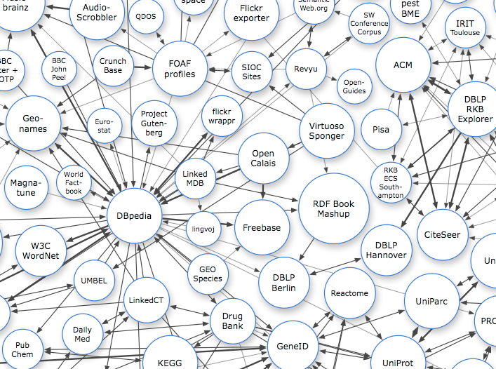
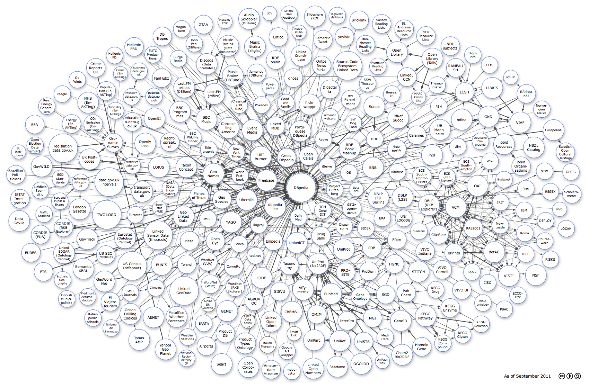
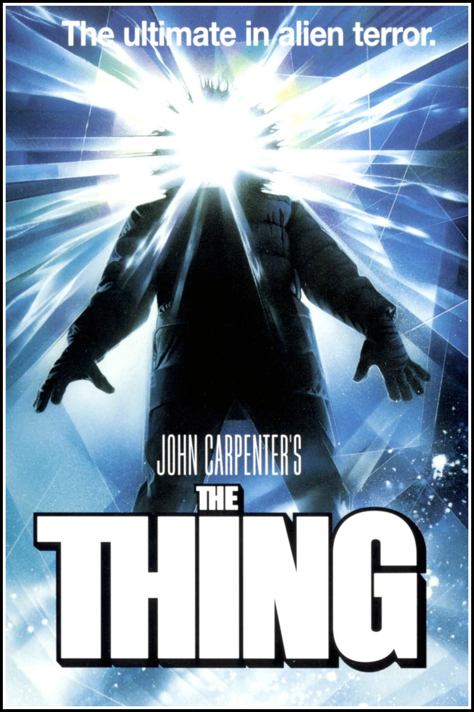
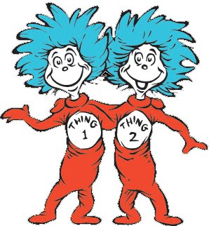
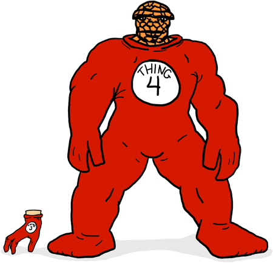
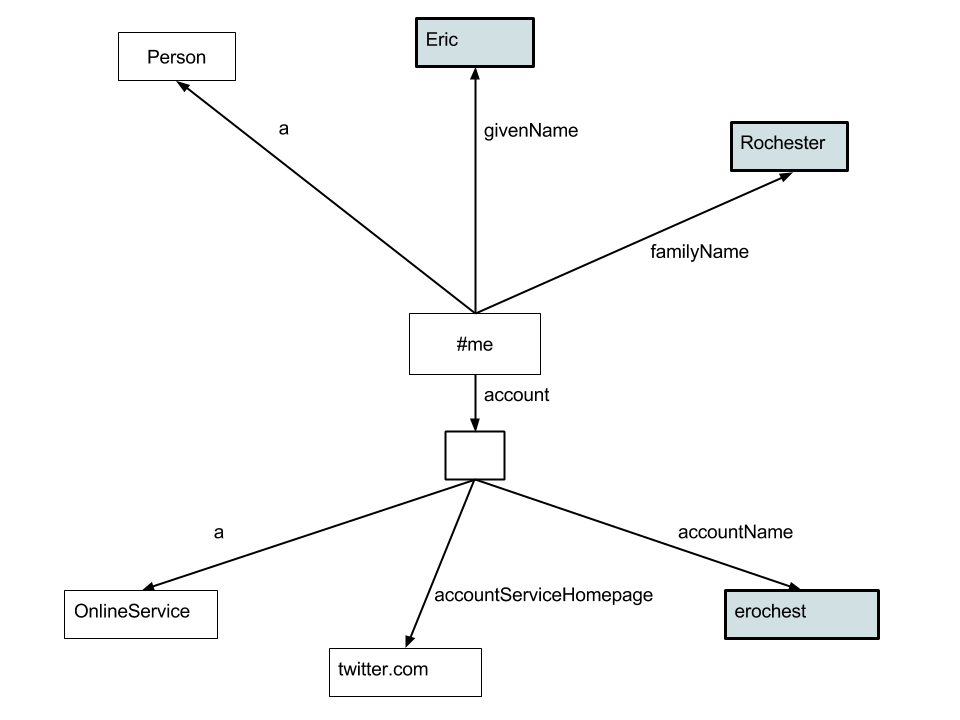
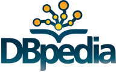
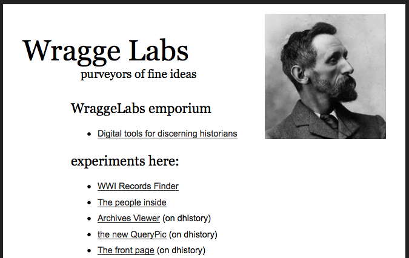

---
title: Linked Open Data
author:
- Eric Rochester
- www.ericrochester.com/lod
date: 17 June 2014
...

## Road Map

* The Vision
* How Computers See the Web
* The Semantic Web
* Break It Down
* Principles
* Starry, Starry Night
* The Universe
* Resource Description Framework (RDF)
* Things
* Shared Vocabularies
* Eeek
* DIY
* Exercise

# The Vision

##

 In the beginning was Tim Berners Lee 

## Now: Human-Readable

## The Web of the Future

## Machine-Readable

# How Computers See the Web

## The Thing

 Physical objects aren't computable 

## The Treachery of Images

 Images are kind of computable 

##

 Easy for people, brittle for machines 

##

Better, structured, inflexible

* One schema to rule them all.
* One block of data.
* One type of data.

# The Semantic Web

## We Were Promised

## But We Got

# Break It Down

## *Linked* Data

An approach. Not islands of data, but islands connected by bridges.

## *Open* Data

A policy. Make it accessible, allow others to view and interact.

## *Data*

A technology, a data structure, a way of modelling knowledge. For machines.

# Principles

## URIs

 Use URIs as names for things 

## HTTP URIs

 So that people can look up those names 

## Standards

 Provide useful information using standards like (RDF and SPARQL) 

## Link

 To other URIs. 

# Starry, Starry Night

Not all or nothing.

## ★

**Open** license

 Visible to all 

## ★★

**Structured**, machine-readable format

 Excel, others can view or manipulate 

## ★★★

**Non-Proprietary** format

 CSV, machines can easily read 

## ★★★★

**HTTP URIs** to identify things

 link, bookmark, reuse 

## ★★★★★

**Link** to other data

 discover 

##

# The Universe

##

# Resource Description Framework (RDF)

## Organizing Data

> * XML trees
> * RDF Graphs

##

## Not a File Format

* RDF/XML
* N3
* Turtle

## Simple Statements

> * Subject
> * Predicate
> * Object

# *Things*

## Is not Its Name

## Is Its URI

## Subjects: URIs

## Predicates: URIs

## Objects: URIs, Values

# Shared Vocabularies

## FOAF

##

## Dublin Core

# Eeek

## The Main Point?

> * SVO
> * Shared Vocabularies

# DIY

## DBPedia

## Wragge Labs

Tim Sherratt:
http://trove.nla.gov.au/ from the National Library of Australia allowed access,
but had no API or machine-readable data. He fixed that by scraping and
re-publishing their data.

# Exercise

# Resources

## LOD

* http://blog.soton.ac.uk/webteam/2011/07/17/linked-data-vs-open-data-vs-rdf-data/
* http://5stardata.info/
* http://lod-cloud.net/
* http://xmlns.com/foaf/spec/
* http://dublincore.org/documents/dces/

## LOD-(G)LAM

* http://www.slideshare.net/jonvoss/intro-to-linked-open-data-in-libraries-archives-museums
* http://obd.jisc.ac.uk/

